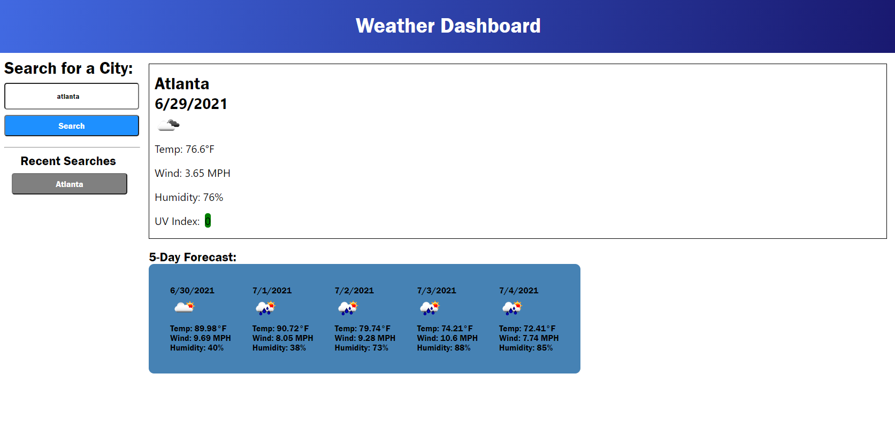

# Weather Dashboard
This application is a weather application that allows the user to search for any city and retrieve the current and future weather data for that city. The application uses API requests to pull weather data from the OpenWeather API based on the city that the user inputs and then display that data to the user. The application also uses Moment.JS to display the date of the data that is being displayed, whether it is the current weather or future forecast.

Upon visiting the webpage, at the top, the user is can see the header title with a linear gradient background. Below that, the user will see multiple sections. To the left, there is an area for the user to search for a city using a text input box and by clicking a search button below the input box. Everytime, the user makes a search, a new button appears below the Recent Searches section, so that the user can keep track of all the searches they have made. To the right, there is a box that says to search a city. Once the user searches a city, the box updates with the name of the city, the current date, an icon depicting what the current weather in that city is like, the current temperature displayed in degrees Fahrenheit, the current wind speed displayed in miles per hour, the current humidity displayed as a percentage, and the current UV index for that city. The UV index has a background color indicating the severity of the UV index. For 0-2 the color is green, for 2-5 the color is yellow, for 5-7 the color is orange, for 7-10 the color is red, and for anything higher than that the color is purple. Below the current weather box, there is a 5-day forecast section. The user is displayed with the date of the forecasted day, the weather icon of the forecasted day, as well as the temperature, wind, and humidity of the forecasted day. Lastly, everytime the user makes a new search, their search term is saved to local storage, making it so they are able to go back and look at their previous searches by clicking the newly created button.

## Link to Repository
[GitHub](https://github.com/mcall0147/weather-dashboard)

## Link to Website
[Work Day Scheduler](https://mcall0147.github.io/weather-dashboard/)

## Screenshot of Working Application
